# FBCSP Training Workflow Flowchart

This flowchart shows the complete execution flow of the FBCSP_Training.m MATLAB code, including all file transitions and key processing steps.

```mermaid
%%{init: {'theme': 'default'}}%%
flowchart TD
    A[FBCSP_Training.m - Entry Point] --> B[Get Environment Variables]
    B --> C[Call batchConvertCsvToMat.m]
    
    C --> D[batchConvertCsvToMat.m]
    D --> E[Scan CSV Directory Structure]
    E --> F[For Each Subject/Session]
    F --> G[Convert JSON Config to MAT]
    G --> H[Convert CSV EEG Data to MAT]
    H --> I[Transform Data Format<br/>Swap columns & transpose]
    I --> J[Save EEG_rec.mat & EEG_config.mat]
    
    J --> K[Return to FBCSP_Training.m]
    K --> L[Clear Variables & Get Environment]
    L --> M[Call T1_proper.m]
    
    M --> N[T1_proper.m]
    N --> O[Call getV1_TRANSConfig.m]
    O --> P[Setup V1_TRANS Configuration]
    P --> Q[Add Toolbox Paths]
    Q --> R[Identify Source Data Structure]
    R --> S[Build File Lists<br/>tr_file_list & tr_subDir_list]
    
    S --> T[Check Previous Results]
    T --> U[Remove Already Processed Files]
    U --> V[Task Manager Loop<br/>For Each File]
    
    V --> W[Copy Channel Locations File]
    W --> X[Load EEG Config]
    X --> Y[Call TA_Dataset_Transfer.m]
    
    Y --> Z[TA_Dataset_Transfer.m]
    Z --> AA[Call cf_TAv2_TrainTest_A1_prep.m]
    AA --> BB[Load EEG_rec Data]
    BB --> CC[Re-distribute Triggers for Q&A]
    CC --> DD[Create TMP Data Directory]
    DD --> EE[Save Processed EEG_rec.mat]
    
    EE --> FF[Return to T1_proper.m]
    FF --> GG[Call STACK_allVariables_01.m]
    GG --> HH[Stack All Variables]
    HH --> II[Setup VA_TRANS Structure]
    
    II --> JJ[Call TAv2_TrainTest.m]
    
    JJ --> KK[TAv2_TrainTest.m]
    KK --> LL[Call cf_TAv2_TrainTest_A1_prep.m]
    LL --> MM[Delete Previous TrainTest Directory]
    
    MM --> NN[A09_EEG_validation Loop]
    NN --> OO[Call VA_A09_EEG_validation_01.m]
    OO --> PP[Validate EEG Channels]
    
    PP --> QQ[A10_offlineClass_prep Loop]
    QQ --> RR[Call VA_A10_offlineClass_prep_01.m]
    RR --> SS[Prepare Offline Classification]
    
    SS --> TT[A10B_offlineTrial_validation Loop]
    TT --> UU[Call VA_A10B_offlineTrial_validation_01.m]
    UU --> VV[Validate Offline Trials]
    
    VV --> WW[A11_offlineClass_classSetup Loop]
    WW --> XX[Call VA_A11_offlineClass_classSetup_01.m]
    XX --> YY[Setup Classification Parameters]
    
    YY --> ZZ[FBCSP Offline TrainTest]
    ZZ --> AAA[Call cf_TAv2_TrainTest_A2_FBCSP.m]
    AAA --> BBB[Initialize Parallel Processing]
    BBB --> CCC[FBCSP Task Manager Loop]
    CCC --> DDD[Call VAv2_FBCSP_offline_trainTest_taskManager_func_01.m]
    DDD --> EEE[Execute FBCSP Training & Testing]
    
    EEE --> FFF[Process Results]
    FFF --> GGG[Calculate Performance Metrics]
    GGG --> HHH[Generate Plots & Visualizations]
    HHH --> III[Call VAv2_Hacked_VB_FBCSP_eval_figures_func_01.m]
    III --> JJJ[Create Frequency & Topoplots]
    
    JJJ --> KKK[Save Results]
    KKK --> LLL[Save VA_TRANS & result structures]
    
    LLL --> MMM[Return to T1_proper.m]
    MMM --> NNN[Call STACK_restore_01.m]
    NNN --> OOO[Restore Variables from Stack]
    OOO --> PPP[Call TA_append_resultSummary.m]
    PPP --> QQQ[Update Results Summary]
    QQQ --> RRR[Call TA_copy_T1_files.m]
    RRR --> SSS[Copy Results to T1 Directory]
    
    SSS --> TTT[Cleanup Temporary Files]
    TTT --> UUU[Delete Temporary Directories]
    
    UUU --> VVV[Next Task Check]
    VVV -->|More Tasks| V
    VVV -->|Complete| WWW[Return to FBCSP_Training.m]
    
    WWW --> XXX[Call reorganiseFiles.m]
    XXX --> YYY[reorganiseFiles.m]
    YYY --> ZZZ[Move Files to Output Directory]
    ZZZ --> AAAA[Convert MAT files to JSON]
    AAAA --> BBBB[Complete Processing]

    style A fill:#e1f5fe
    style D fill:#f3e5f5
    style N fill:#f3e5f5
    style Z fill:#f3e5f5
    style KK fill:#f3e5f5
    style YYY fill:#f3e5f5
    style BBBB fill:#c8e6c9
```

## Key Processing Phases

1. **Data Conversion Phase**: Converts CSV files to MATLAB format
2. **Configuration Phase**: Sets up processing parameters and file structures
3. **Data Transfer Phase**: Prepares EEG data for analysis
4. **Training & Testing Phase**: Executes FBCSP algorithm with validation
5. **Results Processing Phase**: Generates visualizations and saves results
6. **File Organization Phase**: Organizes final output files

## File Transitions

- **Light Blue**: Entry point (FBCSP_Training.m)
- **Purple**: Major file transitions between MATLAB scripts
- **Green**: Final completion state

## Directory Structure

The workflow processes data through the following directory structure:
- `Work/CSV/` → Input CSV files
- `Work/SourceData (EEG_rec)/` → Converted MAT files
- `Work/T1/` → Training results
- `Work/Output/` → Final organized results